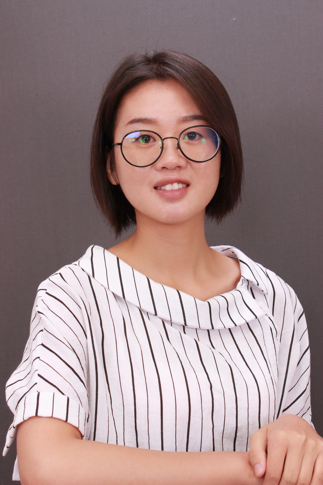

<!--

  

      <ul class="nav">
          <li><a href="https://scholar.google.com/citations?user=nDSGBakAAAAJ&hl=en">Google Scholar</a></li>
          <li><a href="https://github.com/benliemory">Github</a></li>
      </ul>
  

-->

    

        
        

            
        

        

            <h3>Zhenxing Guo</h3>
            Ph.D. Candidate  
            <a href="https://www.sph.emory.edu/departments/bios/">Department of Biostatistics and Bioinformatics</a> 
            <a href="https://www.sph.emory.edu/">Rollins School of Public Health</a> 
            <a href="http://www.emory.edu/home/index.html">Emory University</a> 
            1518 Clifton Road 
            Atlanta, Georgia 30322, USA 
            Phone: (470) 439-5809 

            

            Email: <code>zhenxing</code><b>I</b><code>.</code><b>don't</b><code>guo</code><b>like</b><code>@emory</code><b>spam!
            </b><code>.</code><b>So</b><code>edu</code><b>please</b> 
            

        

    

 Bio

I am now a Ph.D. candidate of the Department of Biostatistics and Bioformatics at Emory University, working with
Professor <a href="http://www.haowulab.org">Hao Wu</a>. My
research interests focus on the development of statistically principled and computationally efficient methd and tools for the analysis of biomedical data, in particular, omics data. In addition to methodology research,
I'm also interested in collaboration projects with clinician and Biologist. My collaboration project involves the study of asthma, cancer
and Alzheimer's disease. 

I received a BS in <a href="http://www-en.hnu.edu.cn/">Applied Mathematics</a> in 2014 from the
Hunan Univeristy;Changsha China, and a MS in <a href="http://english.amss.cas.cn/">Operational Research</a> in 2017 from the Academy of Mathematics and Systems Science at Chinese Academy of Sciences, Beijing; my MS advisor was <a href="http://www.zhanglab-amss.org/homepage/">Professor Shihua Zhang</a>. I will obtain my PhD degree in <a href="https://www.sph.emory.edu/departments/bios/index.html">Biostatistics</a> in summer 2022 from the Department of Biostatistics and Bioinformatics at Emory University; my PhD advisor is <a href="http://www.haowulab.org/">Professor Hao Wu</a>. I will join the <a href="https://www.cuhk.edu.cn/en/taxonomy/term/48">School of Data Science, Chinese Univeristy of Hong Kong, Shenzhen</a> as a tenure-track assistant professor in the fall of 2022. 

 [ <a href="assets/Guo_CV.pdf">CV in pdf</a> ]
 [ <a href="https://scholar.google.com.hk/citations?user=hm0mP4EAAAAJ&hl=zh-CN">Goolge Scholar</a>]
 [ <a href="https://orcid.org">orcid</a>]: [<a href="https://orcid.org/0000-0003-1681-1337">0000-0003-1681-1337</a>]

<!--  -->

